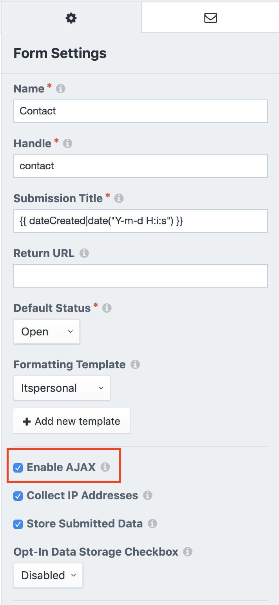

# Snippets

## Freeform AJAX success message

The default Freeform success message when using AJAX is not clear. We use a diffferent approach and hide the form instead.

### Backpanel
Be sure that AJAX is enabled on your form.


### HTML
Make sure you wrap your `success-message` and your form in one div. We'll use this node to look for the closest `success-message` and show it whenever the form has been successfuly sent. Also notice that the freeform snippet uses `form` as the classname. This will be used in the Javascript part.

```twig
    <div class="my-wrapper">
        <div class="success-message">
            Uw bericht is met succes verstuurd!
        </div>
        {{ craft.freeform.form("contact", {
            class: "form",
            instructionsBelowField: true
        }).render() }}
    </div>
```
### Javascript
In the following snippet we loop through all forms with the classname `form`. Whenever the form is successfully sent, the script will remove the form from the DOM and wil display the success message with (in this case) the class `success-message`.

```js
    let forms = Array.from(document.querySelectorAll(".form"));

    forms.forEach(form => {
        form.addEventListener("freeform-ready", function(event) {
            var freeform = event.target.freeform;
            freeform.addOnSuccessfulAjaxSubmit((evt, form, response) => {
                var parent = form.parentNode;
                var message = parent.querySelector(".success-message");
                message.style.display = "block";
                parent.removeChild(form);
            });
        });
    });
```

## Cookie consent

Add following Twig snippet before the end of your `</head>` tag
### Twig

```twig
        
            
            

            
                {% set privacy = "<a href='%privacyUrl%' rel='nofollow' target='_blank'>%privacyLabel%</a>"
                    |replace({'%privacyUrl%': url(privacyUrl.uri)})
                    |replace({'%privacyLabel%': privacyLabel}) %}
            
                {% set privacy = "<span>%privacyLabel%</span>"|replace({'%privacyLabel%': privacyLabel}) %}
            
            
            <link rel="stylesheet" type="text/css" href="https://cdn.jsdelivr.net/npm/cookieconsent@3/build/cookieconsent.min.css" />
            <script src="https://cdn.jsdelivr.net/npm/cookieconsent@3/build/cookieconsent.min.js" data-cfasync="false"></script>
            <script>
                window.addEventListener("load", function(){
                    window.cookieconsent.initialise({
                        "palette": {
                            "popup": {
                                "background": "#F6F7F5",
                                "text": "#272726"
                            },
                            "button": {
                                "background": "#459e10",
                                "text": "#ffffff"
                            }
                        },
                        "theme": "edgeless",
                        "position": "bottom-left",
                        "content": {
                            "message": "{{ "This website uses cookies. I agree with the %privacy%."|t|replace({'%privacy%': privacy})|raw }}",
                            "dismiss": "{{ "OK"|t }}",
                            "link": "",
                            "href": ""
                        }
                    })
                });
            </script>
        
```

## Facebook product feed

```twig


<?xml version="1.0" encoding="utf-8"?>
<rss xmlns:g="http://base.google.com/ns/1.0" version="2.0">
    <channel>
            
                            
                <item>
                    <g:id>
                        {{ product.defaultVariant.sku }}
                    </g:id>
                    <g:title>{{ product.title }}</g:title>
                    <g:description>{{ product.productKind | striptags }}</g:description>
                    <g:link>{{ product.getUrl() }}</g:link>
                    <g:image_link>{{ product.productImage.one().getUrl() }}</g:image_link>
                    <g:brand>Likami</g:brand>
                    <g:condition>new</g:condition>
                    
                        <g:availability>in stock</g:availability>
                    
                        <g:availability>in stock</g:availability>
                    
                        <g:availability>out of stock</g:availability>
                    
                    
                        <g:price>{{ product.defaultVariant.salePrice | number_format(2) }}</g:price>
                    
                        <g:price>{{ product.defaultVariant.price | number_format(2) }} EUR</g:price>
                    
                    <g:google_product_category>469</g:google_product_category>
                </item>
            
        
    </channel>
</rss>
```

## Google shopping feed

```twig


<?xml version="1.0" encoding="utf-8"?>
<rss version="2.0"
     xmlns:dc="http://purl.org/dc/elements/1.1/"
     xmlns:sy="http://purl.org/rss/1.0/modules/syndication/"
     xmlns:admin="http://webns.net/mvcb/"
     xmlns:rdf="http://www.w3.org/1999/02/22-rdf-syntax-ns#"
     xmlns:content="http://purl.org/rss/1.0/modules/content/"
     xmlns:g="http://base.google.com/ns/1.0">
    <channel>
        <title>{{ systemName }}</title>
        <link>{{ parseEnv(currentSite.baseUrl) }}</link>
        
            <item>
                <g:id>
                    {{ product.defaultVariant.sku }}
                </g:id>
                <title>{{ product.title }}</title>
                <description>{{ product.productKind | striptags }}</description>
                <link>{{ product.getUrl() }}</link>
                
                    <g:price>{{ product.defaultVariant.salePrice | number_format(2) }}</g:price>
                
                    <g:price>{{ product.defaultVariant.price | number_format(2) }} EUR</g:price>
                
                <g:condition>new</g:condition>
                
                    <g:availability>in stock</g:availability>
                
                    <g:availability>in stock</g:availability>
                
                    <g:availability>out of stock</g:availability>
                
                <g:image_link>{{ product.productImage.one().getUrl() }}</g:image_link>
                <g:brand>Likami</g:brand>
            </item>
        
    </channel>
</rss>
```